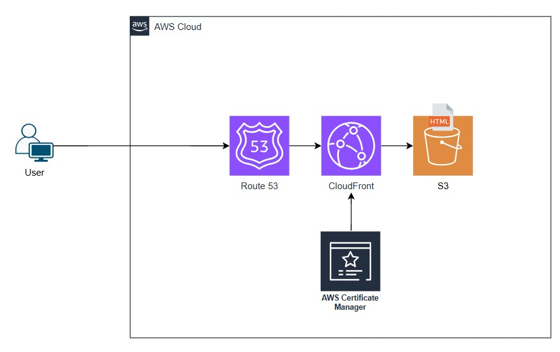

# AWS Static Website Hosting with Amazon S3, CloudFront, and Route 53

## Overview

This project demonstrates how to host a static website on AWS using Amazon S3, Amazon CloudFront, and Amazon Route 53. The architecture provides a secure, scalable, and highly available solution for serving static web content over HTTPS.

This is a common production architecture for hosting personal websites, portfolios, documentation sites, and frontend web applications.

---

## Architecture

---

## Solution Architecture

The solution consists of the following AWS services:

- **Amazon S3** – Hosts the static website files (HTML, images).
- **Amazon CloudFront** – Global Content Delivery Network (CDN) that caches website content close to users for improved performance.
- **Amazon Route 53** – DNS service that routes requests from the custom domain to CloudFront.
- **AWS Certificate Manager (ACM)** – Provides a free SSL/TLS certificate for HTTPS.

---

## Request Flow

1. A user enters the website URL (i.e, `www.rmkideas.xyz`).
2. Amazon Route 53 resolves the domain name to the CloudFront distribution.
3. CloudFront checks whether the requested content is already cached.
4. If the content is cached, CloudFront immediately returns it to the user.
5. If the content is not cached, CloudFront retrieves it from the S3 bucket.
6. CloudFront caches the content for future requests.
7. The user receives the website over HTTPS.

---

## AWS Services Used

| Service | Purpose |
|----------|---------|
| Amazon S3 | Static website hosting |
| Amazon CloudFront | Content Delivery Network (CDN) |
| Amazon Route 53 | DNS hosting |
| AWS Certificate Manager | SSL/TLS certificate |

---

## Benefits

- Highly available
- Globally distributed through CloudFront
- Low latency
- HTTPS encryption
- Low operational cost
- Serverless architecture
- Automatic scaling
- Easy deployment

---

## Security

- HTTPS enabled using AWS Certificate Manager (ACM)
- S3 bucket access restricted through CloudFront Origin Access Control (OAC)
- Website is accessed only through CloudFront
- DNS managed by Route 53

---

## Cost Considerations

This architecture is inexpensive to operate for personal projects.

Typical monthly costs:

- Amazon S3: Free Tier or a few cents depending on storage.
- CloudFront: Free Tier available; low cost for light traffic.
- Route 53: Hosted zone and domain registration (if using a custom domain).
- ACM: Free.

Estimated monthly cost for a personal portfolio website is typically **less than USD $2**, excluding domain registration.

---

## Skills Demonstrated

- Amazon S3
- Amazon CloudFront
- Amazon Route 53
- AWS Certificate Manager (ACM)
- Static Website Hosting
- DNS Configuration
- HTTPS Configuration
- CDN Implementation
- AWS Networking Fundamentals
- Cloud Architecture Design

